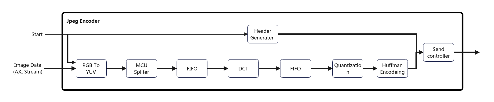

# vivado project template

Jpeg EncoderのRTLプロジェクトです。
RTLのシミュレーション、シミュレーション結果の検証等を行うことができます。

## Make コマンド
[Make] or [Make help]をコマンドラインで入力するとMakeのサブコマンド一覧
が表示されます。詳しくはそちらを確認してください。

動作確認済のシミュレータはVivado simulatorです.


## ディレクトリ構成

```
rtl         --- 合成するモジュール用
tb          --- テストベンチ格納用
tcl         --- vivadoをバッチモードで実行する際のtclファイル
sw_verify   --- シミュレーション結果とSWでの実行決結果を比較
vitis-work  --- vitisを使用する際のディレクトリ
vivado-work --- vivadoを使用する際のディレクトリ(git管理外)
sim_log     --- シミュレーション時のログを格納(git管理外)
sim_work    --- シミュレーション時の生成ファイルを格納(git管理外)
wave        --- 波形ファイルを格納(git管理外)
```

```
.
├── README.md
├── Makefile
├── sim.mk                     //シミュレーション用Makefile
├── rtl
│   └── add.v                  //テンプレートファイル
├── tb
│   └── Tb_Template.sv         //テンプレートファイル
├── tcl
│   ├── create_proj.tcl        //vivadoプロジェクト生成
│   └── generate_bitstream.tcl //ビットストリーム生成
└── vitis-work
```

## ブロック図



## verify

シミュレーション後、make verifyを実行することで
モジュールごとのシミュレーション結果とSWでの実行結果を比較することができます。

### 実行結果(一部)

```
============start rgb check===================
check:ok
============start yuv check===================
check:ok
=============start mcu check=================
check:ok
```